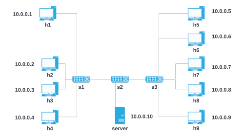

# Networking II project

## Network structure

The network has the following structure:



There are 9 ordinary hosts and a server connected by 3 switches.

The goal of the project is to dynamically start or stop the 3 slices while having a graphical view of the network.

The first slice contains the hosts:
  - h2, h3, h4
  - optionally the server

The first slice contains the hosts:
  - h6, h7, h8, h9
  - optionally the server

The third slice contains just h1 and h5

The server can be disconnected or toggled between the first and the second slice: this way it's always reachable by at most one slice, but never by both.

Another goal of the project is to dinamically set the maximum bandwidth of the slices, but only on the shared connections (for example the first slice is limited only when connecting to the server, not when the hosts connect to each other).

## Dependencies

The GUI implementation relies on TkInter, so make sure to install it using the command

```
sudo apt-get install python3-pil python3-pil.imagetk
```

## Startup
To start the program you have to:
  - open a terminal and navigate to the project folder
  - run the command `ryu-manager controller.py`
  
This command will automatically start the controller, the GUI and a mininet session inside the terminal.

At the beginning all slices are disabled and you can toggle them and cycle over server slices using the buttons on the right.

Using the sliders and the "SET" buttons it is also possible to limit the bandwidth of the slices.

To verify bandwidth between two hosts it is possible to use the iperf command, either via the CLI opened in the terminal or by using the GUI.

To stop the program you must close the graphical window and exit from mininet in the terminal. After that, the program will automatically clean up the environment.